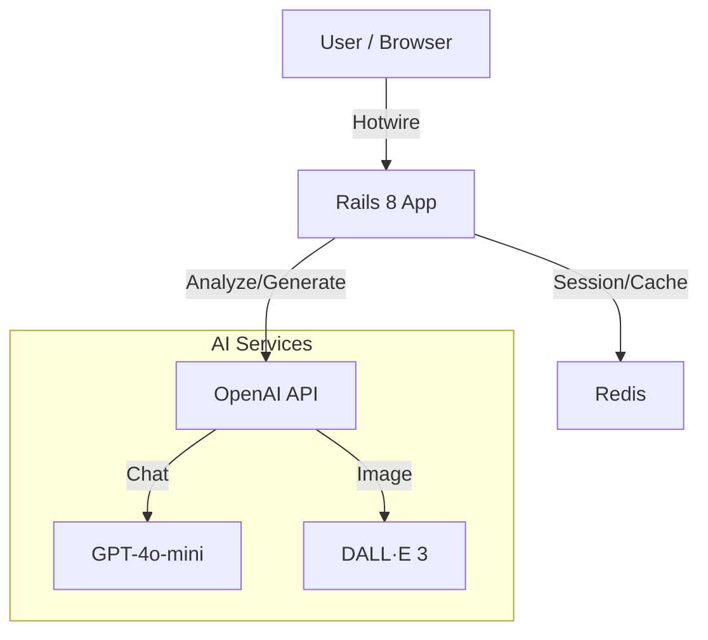

# MBTIをAIで診断するアプリ (CreativeHackAward)

   
  <h3>物語の中で自分を知る、新しい性格診断体験。</h3>
   
  

 

**ただの「4文字」を知るだけではありません。**  
このアプリは、AIが即興で紡ぐ物語に参加することで、あなたの深層心理や行動パターンを分析します。  
無機質な質問リストの代わりに、ホラー、冒険、ミステリーといった物語の主人公として振る舞うことで、より自然で本質的な「あなた」が見えてきます。

---

## ✨ 特徴 (Features)

### 📖 物語モード (Story Mode)
AIがゲームマスターとなり、あなたの選択に応じて物語がリアルタイムに変化します。
- **Horror (ホラー)**: 古い屋敷での恐怖体験
- **Adventure (冒険)**: 未知の遺跡探索
- **Mystery (ミステリー)**: 難解な事件の解決
- **Creator (カスタム)**: あなた自身が設定を作るカスタムモード

### 🧠 AIによる深層分析 (Deep AI Analysis)
回答の「何を選んだか」だけでなく「なぜそうしたか（自由記述）」をGPT-4oが分析。
型にはまった判定ではなく、あなたの思考プロセスそのものを言語化します。

### 🎨 多面的な体験 (Multimedia Experience)
診断結果はテキストだけではありません。
- **Music**: あなたの性格に共鳴する楽曲をAIが提案
- **Image**: あなたの内面世界をDALL·Eが抽象画として具現化

---

## 🎮 遊び方 (How to Play)

1. **エンジンの選択**: 通常の質問モードか、対話型のゲームマスターモードかを選びます。
2. **物語を選ぶ**: 今日の気分に合わせて物語のジャンルを選択。
3. **没入する**: 物語の登場人物になりきって、直感で行動を選択・記述してください。
4. **発見する**: 物語の結末とともに、詳細な分析レポートとあなただけの「テーマソング」「イメージ画」が届きます。

---

## 🛠 技術スタック (Technology Stack)

  
  
  
  
  

### システムアーキテクチャ

詳細は [docs/API.md](docs/API.md) をご覧ください。

---

